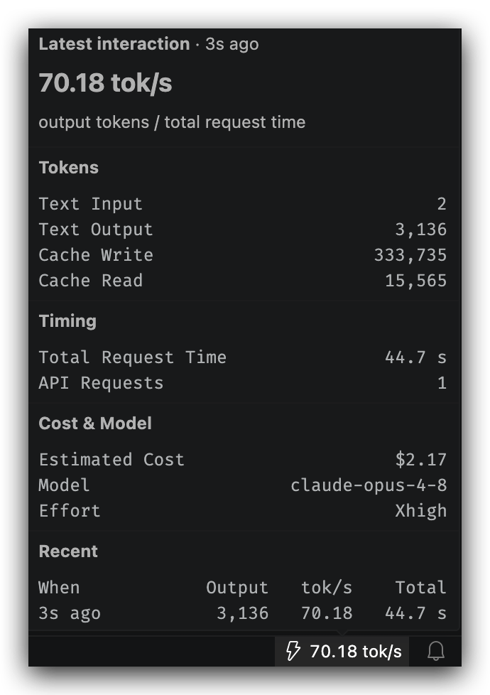
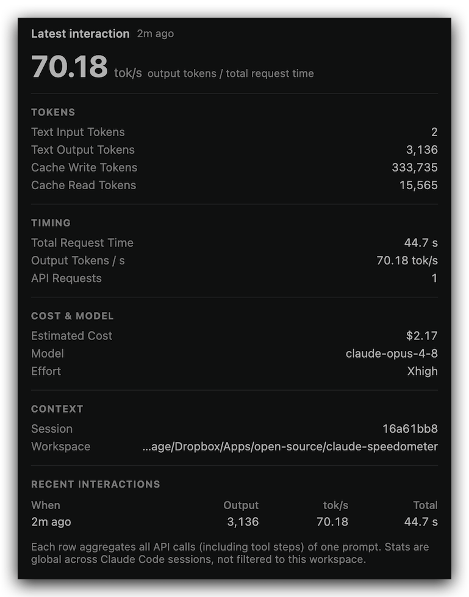

# Claude Speedometer

A VS Code status-bar indicator showing the **token throughput and timing of your latest Claude Code interaction**.

The bolt sits at the far right of the status bar, immediately left of the notification bell: `↯ 70.2 tok/s`, and updates after every interaction. **Hover** it for a quick stats overlay; **click** it to open a full stats tab (click again to close).

## What it looks like

|  |  |
| :------------------------------------------------------------: | :-------------------------------------------------------------: |
|              _Hover the bolt for a quick overlay_              |                _Click it for the full stats tab_                |

## Setup

Once installed, the extension needs Claude Code to export telemetry to it:

1. On first run it offers to configure Claude Code for you. Accept, or run **`Claude Speedometer: Configure Claude Code Telemetry`** from the Command Palette. This merges the following into `~/.claude/settings.json` (existing settings are preserved):

   ```json
   {
     "env": {
       "CLAUDE_CODE_ENABLE_TELEMETRY": "1",
       "OTEL_LOGS_EXPORTER": "otlp",
       "OTEL_EXPORTER_OTLP_PROTOCOL": "http/json",
       "OTEL_EXPORTER_OTLP_ENDPOINT": "http://localhost:4318",
       "OTEL_LOGS_EXPORT_INTERVAL": "2000"
     }
   }
   ```

2. **Restart Claude Code** so it picks up the new environment.
3. Run a prompt. The bolt updates with the throughput; hover for details.

## Reading the stats

The bolt shows the **last completed** interaction's tok/s. It updates when a turn finishes, not while it is still running, so the figure is stable. The overlay and the tab break the latest turn into sections:

- **Speed**: output tok/s (output tokens / total request time).
- **Tokens**: input, output, cache-write, cache-read. "Output" counts thinking and visible text together; Claude Code's telemetry does not report them separately.
- **Timing**: total request time and API request count.
- **Cost (estimated)**: spend for the current interaction, today, this week (from Monday), and this month. Day/week/month windows are bucketed by **UTC** calendar day; the totals accrue from when telemetry was enabled and survive turn pruning.
- **Model**: model, plus **reasoning effort** (only when the model supports it) and **Fast mode** (only when it is on).
- **Recent**: the last several interactions at a glance.
- **Context** (tab only): the session id and the full workspace path. The session id is the name of the session's `~/.claude/projects/.../<id>.jsonl` transcript and the `claude --resume <id>` handle.

A few things to know about the numbers:

- tok/s is `output tokens / total request time`, summing each API call's wall-clock `duration_ms` (server time plus network and any retries). Tool-execution gaps and time you spend typing or queueing between requests are **not** counted.
- Output tokens, and therefore tok/s, include both thinking and visible text. Claude Code reports a single output count, so the two cannot be separated here.
- One "interaction" sums all API calls of a single prompt (`prompt.id`), including tool-call steps and any sub-agents the prompt spawns.
- Stats are **global** across all Claude Code sessions and windows, not filtered to the current workspace.
- Interaction times show the wall-clock time **in your local timezone** plus a live "x ago" hint that refreshes on its own, so it stays accurate instead of freezing at the value from the last interaction.

## Settings

| Setting                               | Default                    | Meaning                                                                                                                                      |
| ------------------------------------- | -------------------------- | -------------------------------------------------------------------------------------------------------------------------------------------- |
| `claudeSpeedometer.port`              | `4318`                     | Port the receiver listens on (must match the OTLP endpoint).                                                                                 |
| `claudeSpeedometer.exportIntervalMs`  | `2000`                     | `OTEL_LOGS_EXPORT_INTERVAL` written during auto-config. Lower = more responsive.                                                             |
| `claudeSpeedometer.statusBarPriority` | `-Number.MAX_SAFE_INTEGER` | Position in the right cluster. Higher = further left; the default pins the bolt at the far right, immediately left of the notification bell. |
| `claudeSpeedometer.retentionDays`     | `7`                        | Discard interactions older than this many days.                                                                                              |

## How it works

VS Code extensions can't read Claude Code's internal timing directly, so the extension runs a tiny OTLP/HTTP receiver on `localhost:4318` (loopback only), and Claude Code is configured to export its telemetry there. Each `claude_code.api_request` event carries the token, timing, and cost fields shown above.

It is **one machine-wide speedometer**: each VS Code window tries to bind the port; the one that succeeds runs the receiver and publishes to a shared file (`~/.claude-speedometer/state.json`, the last 1,000 turns / 7 days plus ~70 days of daily cost totals, safe to delete), and every other window mirrors that file. When the leader window closes, a follower takes over within a couple of seconds.

## Development

```bash
npm install
npm run compile      # or: npm run watch
```

To try a change, build a `.vsix` with [`vsce`](https://github.com/microsoft/vscode-vsce) and install it:

```bash
npx @vscode/vsce package
code --install-extension claude-speedometer-<version>.vsix --force
```

Then run **Developer: Reload Window** so the new build loads. The receiver is machine-wide, so reload every open window (or restart VS Code) for the leader to pick up the new code, then restart Claude Code.
