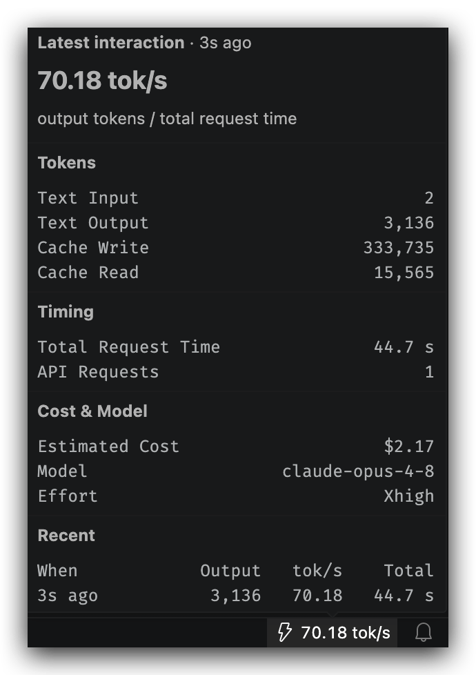
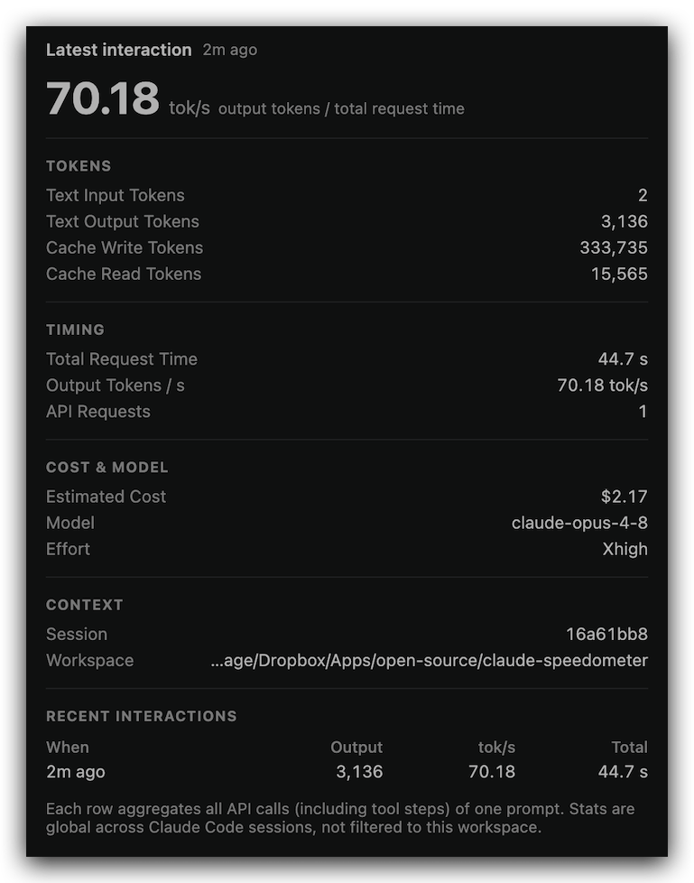

# Claude Speedometer

A VS Code status-bar indicator showing the **token throughput and timing of your latest Claude Code interaction**.

The bolt sits at the far right of the status bar, immediately left of the notification bell: `↯ 70.2 tok/s`, and updates after every interaction. **Hover** it for a quick stats overlay; **click** it to open a full stats tab (click again to close).

## What it looks like

|  |  |
| :------------------------------------------------------------: | :-------------------------------------------------------------: |
|              _Hover the bolt for a quick overlay_              |                _Click it for the full stats tab_                |

## Setup

Once installed, the extension needs Claude Code to export telemetry to it:

1. On first run it offers to configure Claude Code for you. Accept, or run **`Claude Speedometer: Configure Claude Code Telemetry`** from the Command Palette. This merges the following into `~/.claude/settings.json` (existing settings are preserved):

   ```json
   {
     "env": {
       "CLAUDE_CODE_ENABLE_TELEMETRY": "1",
       "OTEL_LOGS_EXPORTER": "otlp",
       "OTEL_EXPORTER_OTLP_PROTOCOL": "http/json",
       "OTEL_EXPORTER_OTLP_ENDPOINT": "http://localhost:4318",
       "OTEL_LOGS_EXPORT_INTERVAL": "2000"
     }
   }
   ```

2. **Restart Claude Code** so it picks up the new environment.
3. Run a prompt. The bolt updates with the throughput; hover for details.

## Reading the stats

The bolt shows the **last completed** interaction's tok/s. It updates when a turn finishes, not while it is still running, so the figure is stable. The overlay and the tab break the latest turn into sections:

- **Speed**: output tok/s (output tokens / total request time).
- **Tokens**: input, output, cache-write, cache-read. "Output" counts thinking and visible text together; Claude Code's telemetry does not report them separately.
- **Timing**: total request time and API request count.
- **Cost (estimated)**: spend for the current interaction, today, this week (from Monday), this month, and last month.
  The windows are bucketed by **UTC** calendar day, and the totals accrue from when telemetry was enabled and survive turn pruning.
  An interaction on a model Claude Code cannot price reads as `unpriced` unless you have configured a rate for it, and a total containing one is marked `≥`.
  See [Where the Cost Figures Come From](#where-the-cost-figures-come-from) for how the dollar amounts are computed and what they mean.
- **Model**: model, plus **reasoning effort** (only when the model supports it) and **Fast mode** (only when it is on).
  A long id is shortened to the name itself, dropping a provider namespace along with the shared `claude-` prefix, so `accounts/fireworks/models/kimi-k3` reads as `kimi-k3`.
  The tab keeps the full id on hover.
- **Recent** (tab only): the last several interactions, one row each, with local time, workspace folder, session id, model and effort, input tokens, output tokens, and speed (tok/s).
  Cells are abbreviated to keep the columns tight: the time drops the year, the workspace shows only its innermost folder, and the model id drops a provider namespace along with the shared `claude-` prefix (a long one is also cut short).
  Hover any of them for the full value.
- **Workspace** (tab only): the session id and the full directory path. The session id is the name of the session's `~/.claude/projects/.../<id>.jsonl` transcript and the `claude --resume <id>` handle.

A few things to know about the numbers:

- tok/s is `output tokens / total request time`, summing each API call's wall-clock `duration_ms` (server time plus network and any retries). Tool-execution gaps and time you spend typing or queueing between requests are **not** counted.
- Output tokens, and therefore tok/s, include both thinking and visible text. Claude Code reports a single output count, so the two cannot be separated here.
- One "interaction" sums a single prompt's (`prompt.id`) API calls **to one model**, including tool-call steps and any sub-agents that run on that model.
  Claude Code stamps every request it makes while a prompt is in flight with that prompt's id, including ones it routes to a different model, so the Haiku call that names a new session becomes its own interaction instead of adding its tokens to your turn.
- Stats are **global** across all Claude Code sessions and windows, not filtered to the current workspace.
- Interaction times show the wall-clock time **in your local timezone** plus a live "x ago" hint that refreshes on its own, so it stays accurate instead of freezing at the value from the last interaction.

### Where the Cost Figures Come From

Every interaction is costed in one of three ways, and the tab and overlay show which:

| Shown as   | The interaction                      | Source of the figure                           |
| ---------- | ------------------------------------ | ---------------------------------------------- |
| `$0.81`    | went to Anthropic's API              | Claude Code's own `cost_usd`                   |
| `$0.02`    | went elsewhere, and you have a rate  | recomputed here from its token counts          |
| `unpriced` | went elsewhere, and you have no rate | none, and it is never shown as `$0.00` instead |

Claude Code computes `cost_usd` client-side, multiplying the token counts the API returns by a pricing table bundled into the CLI.
When no row in that table matches the model id it does not report nothing: it falls back to the default model's rate, so a request served by another provider arrives priced as Claude.
This extension therefore ignores that figure for any request it cannot confirm went to Anthropic, and prices the request from your own rates instead.
Which provider served a request is decided from the base URL, never from the model name, because a gateway can serve a model called `~anthropic/claude-opus-latest` at its own rates.
With one exception: a base-URL reading that says Anthropic is disbelieved when the model id on the response is not one Anthropic's API has (a provider path like `accounts/fireworks/models/kimi-k3` could never be served by api.anthropic.com), because the id is direct evidence while a configured URL can be stale or describe another window's account.

In practice:

- **Accuracy tracks your Claude Code version, not this extension.** The price table ships inside the CLI, so an outdated Claude Code prices new requests with the stale rates it shipped with. Keep Claude Code updated if you want current rates. Anthropic's own docs call these figures approximations; for authoritative billing use the [Claude Console](https://platform.claude.com/usage).
- **On a Pro/Max subscription the number is not a charge.** Claude Code computes `cost_usd` the same way regardless of how you authenticate, so for subscribers it reads as "what this usage would have cost at standard per-token API prices". It is a value-of-usage gauge; subscription quota consumption is not part of the telemetry.
- **Totals are a floor.** Telemetry is only received while a VS Code window is open to run the receiver, so Claude Code sessions run with every window closed (or started before telemetry was configured) are never recorded. Events that lack a `cost_usd` field count as $0 regardless of their token counts, and a total that leaves out an unpriced interaction is marked `≥`.

### Pricing a Third-Party Provider

Set `claudeSpeedometer.modelPricing` to your provider's rates, in USD per million tokens:

```jsonc
"claudeSpeedometer.modelPricing": {
  "byEndpoint": {
    "https://api.z.ai/api/anthropic": {
      "glm-5.3": { "input": 1.4, "output": 4.4, "cacheRead": 0.26, "cacheWrite": 1.4 },
      "glm-5.3-flash": { "input": 0.15, "output": 0.5, "cacheRead": 0.03, "cacheWrite": 0.15 }
    }
  }
}
```

The outer key is the `ANTHROPIC_BASE_URL` you configured for Claude Code, matched case-insensitively.
Use `"*"` as a model id to price everything that endpoint serves.
`byModel` maps model ids straight to rates and applies only when the base URL cannot be read at all.
Note that model ids are matched as the API response reports them from the server, which can differ from the model id string you configured.

All four rates are required.
A cache write costs 1.25x to 2x the input rate on Anthropic's billing, but only the plain input rate on a gateway that bills input, cached input and output alone, so it cannot be derived from the others.

The base URL is read from `~/.claude/settings.json`, then from the session's own project `.claude/settings.json` and `.claude/settings.local.json`, then from this window's environment, with the later sources winning.
Each interaction is classified on its own, so a session that runs one model for your turns and a cheaper one for background work is costed correctly at both rates.
If your setup injects the base URL directly into the Claude Code process, where no file records it, an extension in the same window can supply it instead through a `getBillingContext()` export (see `claudeSpeedometer.billingContextProvider`).

## Settings

| Setting                                    | Default                    | Meaning                                                                                                                                      |
| ------------------------------------------ | -------------------------- | -------------------------------------------------------------------------------------------------------------------------------------------- |
| `claudeSpeedometer.port`                   | `4318`                     | Port the receiver listens on (must match the OTLP endpoint).                                                                                 |
| `claudeSpeedometer.exportIntervalMs`       | `2000`                     | `OTEL_LOGS_EXPORT_INTERVAL` written during auto-config. Lower = more responsive.                                                             |
| `claudeSpeedometer.statusBarPriority`      | `-Number.MAX_SAFE_INTEGER` | Position in the right cluster. Higher = further left; the default pins the bolt at the far right, immediately left of the notification bell. |
| `claudeSpeedometer.retentionDays`          | `7`                        | Discard interactions older than this many days.                                                                                              |
| `claudeSpeedometer.modelPricing`           | `{}`                       | Rates for models Claude Code cannot price. See [Pricing a Third-Party Provider](#pricing-a-third-party-provider).                            |
| `claudeSpeedometer.billingContextProvider` | `auto`                     | Which extension to ask where Claude Code is sending requests. `off` asks none, and any other value pins one extension id.                    |
